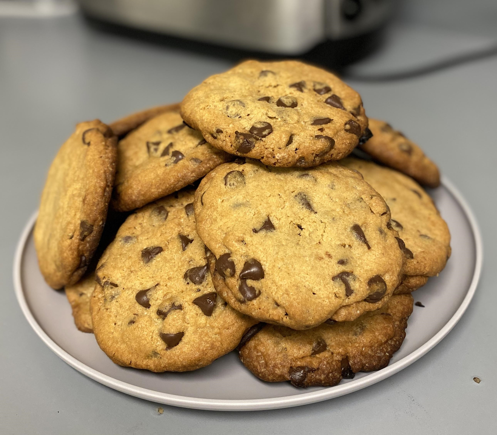

# Who is Jennifer Yu

## Programmer
- I'm currently working as an online instructor for Code Central Las Vegas. We teach students K-12 in various topics of computer science like Scratch, Python coding, Arduino, web development, game development, and more. You can learn more about us [here](https://mycodecentral.com/)!
  
- Last summer I had the opportunity to work as a STEP intern at Google. I was a part of the Assistant Team working on Google TV. I learned C++ for my project and was able to gain experience working in the industry.
  
- My favorite programming language is Java, but I have experience with some other ones as well. Nothing beats typing `System.out.println();` over and over again though.
  - [What I said in my readme](README.md)

## Hobbies
- **Games!** I mostly play PvP Tetris on a website called Tetr.io. Other than Tetris, I play League and Valorant.
  - [Here's my profile](https://ch.tetr.io/u/jhxyjhxy)
- **Books!** Currently reading Stephen King's *The Dark Tower* series. The first book's ending made me feel a little existential.
> 
 The mystery of the universe is not time but size.   - <i>The Gunslinger</i>
- **Cooking and baking!** I bake cookies or bread whenever I'm stressed and meal prep when I'm bored. 
> 

## Goals for this class
- [ ] Meet new people
- [ ] Get industry-like experience
- [ ] Learn more about web development
- [x] Finish this lab!